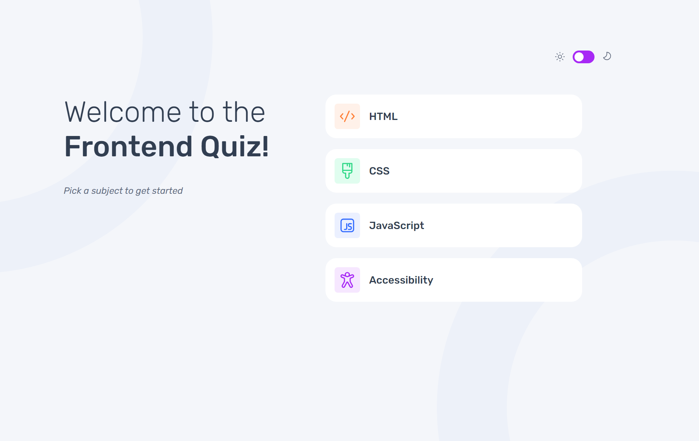
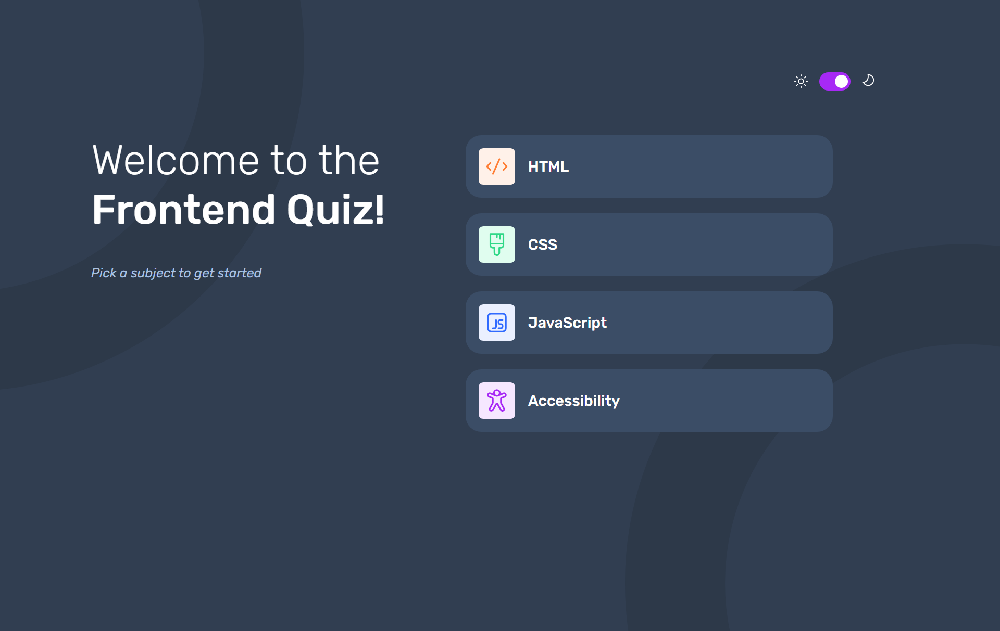

# Frontend Mentor - Frontend quiz app solution

This is a solution to the [Frontend quiz app challenge on Frontend Mentor](https://www.frontendmentor.io/challenges/frontend-quiz-app-BE7xkzXQnU).. Frontend Mentor challenges help you improve your coding skills by building realistic projects. 

## Table of contents

- [Overview](#overview)
  - [The challenge](#the-challenge)
  - [Screenshot](#screenshot)
  - [Links](#links)
- [My process](#my-process)
  - [Built with](#built-with)
  - [What I learned](#what-i-learned)
  - [Continued development](#continued-development)
  - [Useful resources](#useful-resources)
- [Author](#author)
- [Acknowledgments](#acknowledgments)


## Overview

### The challenge

Users should be able to:

- Select a quiz subject
- Select a single answer from each question from a choice of four
- See an error message when trying to submit an answer without making a selection
- See if they have made a correct or incorrect choice when they submit an answer
- Move on to the next question after seeing the question result
- See a completed state with the score after the final question
- Play again to choose another subject
- View the optimal layout for the interface depending on their device's screen size
- See hover and focus states for all interactive elements on the page
- Navigate the entire app only using their keyboard
- **Bonus**: Change the app's theme between light and dark

### Screenshot


Light Theme Mode



Dark Theme Mode


### Links

- Solution URL: [Source Code](https://github.com/jyanokye/Quiz-App)
- Live Site URL: [Quiz App](https://quizapp-anokye-james-projects.vercel.app/)

## My process

### Built with

- [TypeScript](https://www.typescriptlang.org/) - TypeScript
- [React](https://reactjs.org/) - JS library
- [Styled Components](https://styled-components.com/) - For styling
- Semantic HTML5 markup
- CSS custom properties
- Flexbox
- CSS Grid
- Mobile-first workflow


### What I learned

During this project, I focused on improving my understanding of React state management and TypeScript props handling. Here are some key takeaways:

- **React State Management**: Learned how to effectively manage component state to handle user interactions and update the UI dynamically.Here's an example from my `Question` component:

```tsx
const Question: React.FC<QuestionProps> = ({
  question,
  options,
  onSelect,
  currentQuestionIndex,
  totalQuestions,
  answerSelected,
  completionPercentage,
  handleSubmit,
  isDark,
  correctAnswer,
}) => {
  const [selectedOption, setSelectedOption] = useState<number | null>(null);
  const [attemptedSubmit, setAttemptedSubmit] = useState<boolean>(false);
  const [submitted, setSubmitted] = useState<boolean>(false);
  const [showFeedback, setShowFeedback] = useState<boolean>(false);


  const handleOptionClick = (index: number) => {
    if (!submitted) {
      onSelect(index);
      setSelectedOption(index);
    }
  };

};
```

- **TypeScript Props Handling**: Gained proficiency in using TypeScript to define and validate props passed to components, ensuring type safety throughout the application.Here's an example of props handling in my Quiz component:


```tsx
const Quiz: React.FC<QuizProps> = ({ subject, goBack, isDark }) => {
  const [currentQuestionIndex, setCurrentQuestionIndex] = useState(0);
  const [score, setScore] = useState(0);
  const [answers, setAnswers] = useState<number[]>([]);
  const [answerSelected, setAnswerSelected] = useState(false);

  const handleAnswerSelect = (index: number) => {
    setAnswers(prevAnswers => {
      const newAnswers = [...prevAnswers];
      newAnswers[currentQuestionIndex] = index;
      return newAnswers;
    });
    setAnswerSelected(true);
  };

};
```


### Continued development

In future projects, I plan to continue focusing on:

- Refining my knowledge of React hooks and exploring more advanced state management patterns.
- Strengthening my TypeScript skills to handle more complex data structures and interactions.


### Useful resources

- [React State Management](https://react.dev/learn/managing-state) - This resource helped me understand advanced React state management techniques.
- [TypeScript HandBook](https://www.typescriptlang.org/docs/handbook/2/functions.html) - Useful article that deepened my knowledge of TypeScript props handling in React.

## Author

- Website - [Anokye James Yaw](https://www.your-site.com)
- Twitter - [@james559155054](https://www.twitter.com/james559155054)


## Acknowledgments

My premier thanks go to Amalitech GmbH for the invaluable opportunity to participate in this project as part of their Pre-Selection Training for Prospective National Service Personnel. This appreciation will be incomplete  without acknowledging a few friends who helped review my code.

